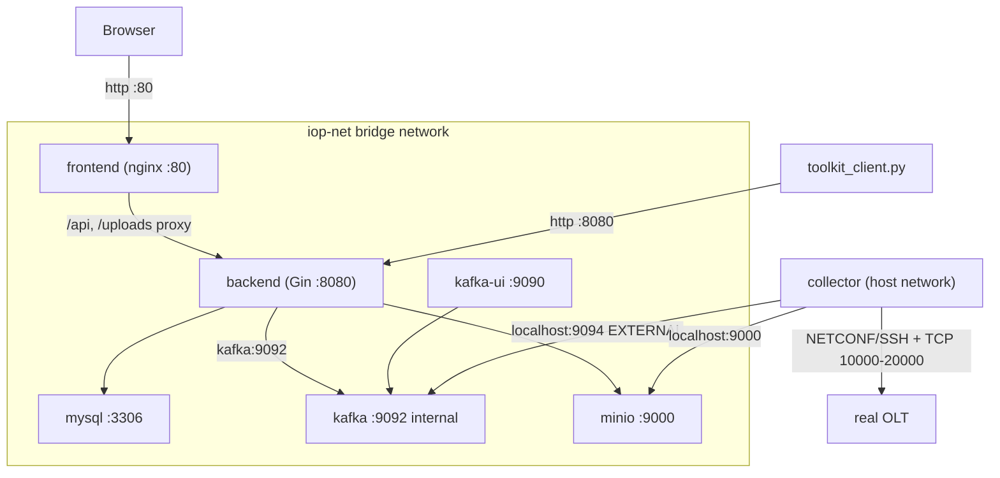
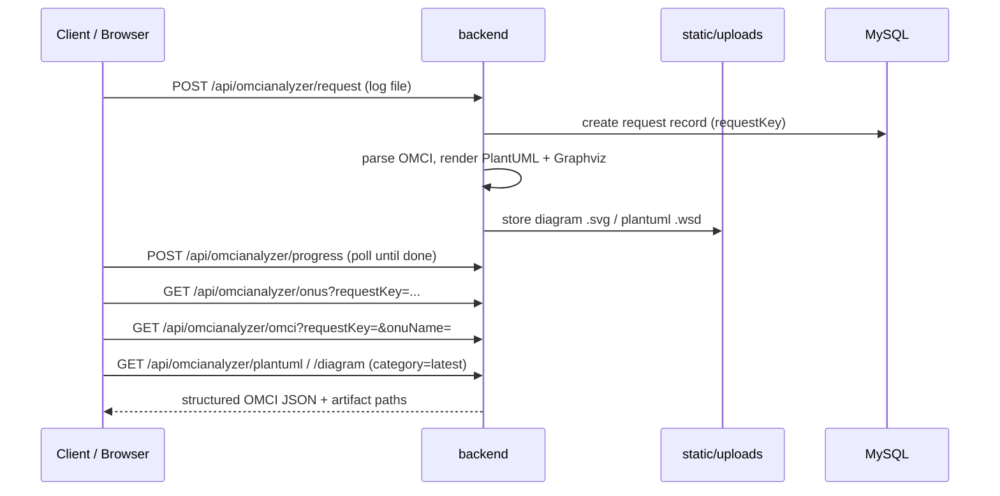
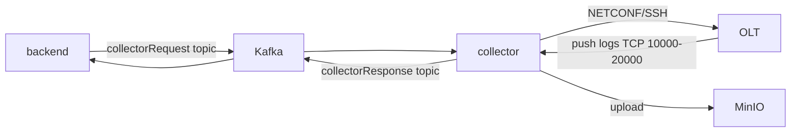

# iop-toolkit

`iop-toolkit` bundles the full IOP/OMCI analysis stack into a single repository
that deploys with **one command**. It parses raw IOP/OMCI logs into structured
OMCI JSON, renders PlantUML/Graphviz sequence diagrams, collects live logs from
OLTs, and serves a web UI.

## Components

| Directory                  | Component | Tech           | Role |
|----------------------------|-----------|----------------|------|
| [`backend/`](backend/)     | omcianalyzer | Go (Gin)     | Core API: log parsing, OMCI decode, diagram rendering, library, downloads |
| [`collector/`](collector/) | collector | Python         | Collects logs from OLTs (NETCONF/SSH), uploads to MinIO, talks to backend over Kafka |
| [`frontend/`](frontend/)   | webioptoolkit | React + Vite | Web UI, served by nginx and reverse-proxying `/api` to the backend |
| [`deploy/`](deploy/)       | deployment | Docker Compose | Orchestrates all services plus MySQL, Kafka, MinIO |

## Architecture



## End-to-end log analysis flow



## Live collection flow



## Quick start

```bash
cd deploy
cp .env.example .env            # adjust ports/credentials if needed

# One-time: export the IOP_Library database so it is restored on first boot.
./scripts/migrate-mysql.sh      # dumps from the 238 server via SSH

docker compose up -d --build
```

Then open:

- Web UI: `http://localhost/` (or `http://<host>/`)
- Backend API: `http://localhost:8080/`
- Kafka UI: `http://localhost:9090/`
- MinIO console: `http://localhost:9001/`

## Testing

```bash
cd deploy
./scripts/test/run_tests.sh
```

The suite validates infrastructure health (MySQL tables/data, MinIO bucket,
Kafka topics), the backend end-to-end pipeline (upload -> parse -> OMCI JSON /
PlantUML / diagram) using the bundled sample log, and the frontend reverse
proxy.

## Platform notes (WSL vs server)

| Aspect            | WSL (Ubuntu, personal) | Server (238, Rocky) |
|-------------------|------------------------|---------------------|
| Deploy command    | `docker compose up -d --build` | same |
| Auto-start on boot| Docker daemon is not auto-started, so containers stay down until you start Docker manually | Docker starts at boot, so `restart: always` brings the stack back automatically |
| Build proxy       | usually empty          | corporate proxy in `.env` |
| Collector         | host networking (Linux) | host networking (Linux) |

`restart: always` is used uniformly; it only results in boot auto-start where
the Docker daemon itself starts at boot (the server), which matches the desired
behavior without any per-platform configuration.

## Deployment sequence and rollback

See [`deploy/README.md`](deploy/README.md) for the full Phase A (validate on
WSL) -> Phase B (cut over on 238) procedure, including how the previous
services are stopped and how to roll back.
