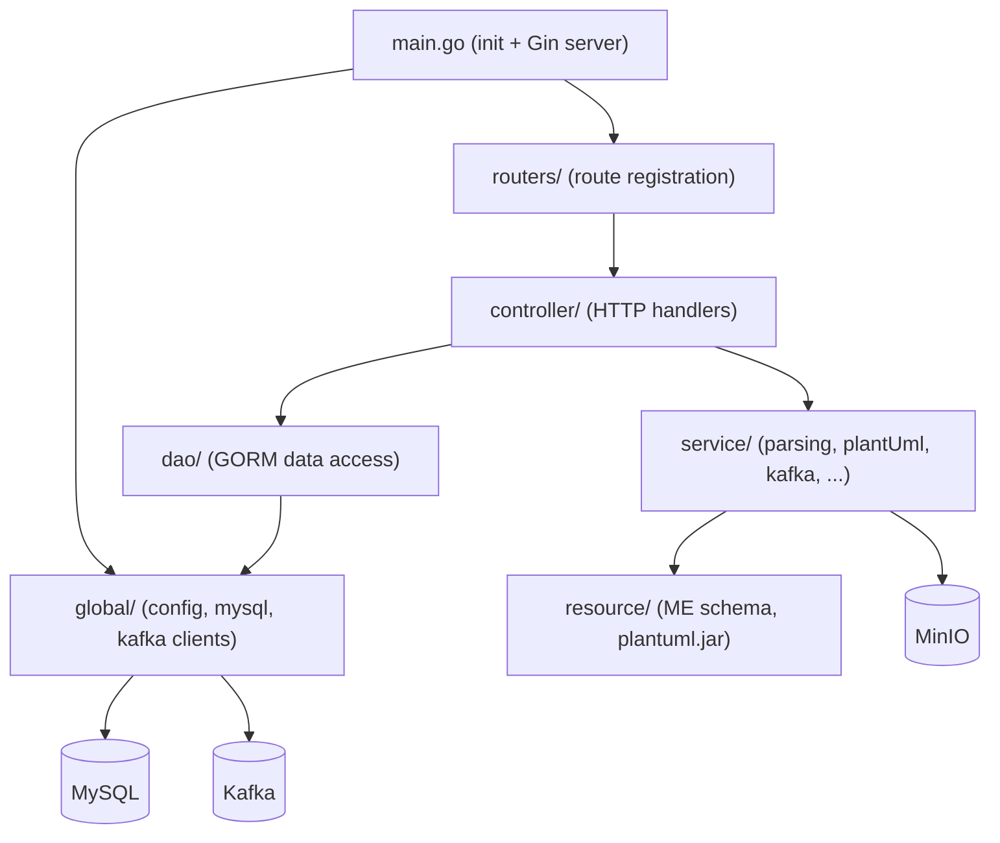
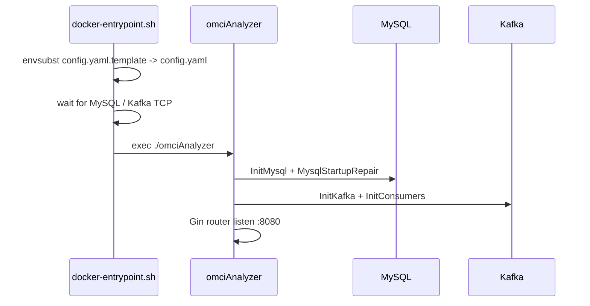

# backend (omcianalyzer)

Go (Gin) service that powers `iop-toolkit`: it parses raw IOP/OMCI logs into
structured OMCI JSON, renders sequence diagrams (PlantUML + Graphviz), and
exposes the library, collector-bridge, sequence-tracer and downloads APIs.

## Module layout



| Package        | Responsibility |
|----------------|----------------|
| `main.go`      | Loads config, connects MySQL/Kafka, registers routes, serves `:8080` |
| `global/`      | `conf.go` (YAML config), `mysql.go` (GORM), `kafka.go` (Sarama client) |
| `routers/`     | Route groups: omcianalyzer, library, collector, sequenceTracer, downloads |
| `controller/`  | Request handlers; `controller/omci`, `controller/collector` submodules |
| `service/`     | Core logic: `omcianalyzer`, `omciDeshape`, `plantUml`, `kafka`, `sequencetracer`, `validation` |
| `dao/`         | CRUD over request/response/library records |
| `resource/`    | OMCI Managed Entity schemas and `plantUml/plantuml.jar` |

## Startup sequence



## Configuration (environment-driven)

At container start, `docker-entrypoint.sh` renders `config/config.yaml` from
`config/config.yaml.template` using these variables (defaults target the
docker-compose service names):

| Variable | Default | Description |
|----------|---------|-------------|
| `SERVER_HTTP_PORT` | `8080` | Listen port |
| `SERVER_ADDR` | `0.0.0.0:8080` | Bind address |
| `MYSQL_ADDR` | `mysql:3306` | MySQL host:port |
| `MYSQL_USER` / `MYSQL_PASSWORD` | `iop` / `eonu#1234` | Credentials |
| `MYSQL_DATABASE` | `IOP_Library` | Database name |
| `KAFKA_ADDR` | `kafka:9092` | Broker (internal listener) |
| `KAFKA_TOPIC_REQUEST` / `KAFKA_TOPIC_RESPONSE` | `collectorRequest` / `collectorResponse` | Topics |
| `MINIO_ENDPOINT` | `minio:9000` | MinIO endpoint |
| `MINIO_ACCESS_KEY` / `MINIO_SECRET_KEY` | `eonu` / `eonu#1234` | Credentials |
| `MINIO_BUCKET` | `olt-logs` | Bucket |

## Key API endpoints

| Method | Path | Description |
|--------|------|-------------|
| POST | `/api/omcianalyzer/request` | Upload log file(s), returns `requestKey` |
| POST | `/api/omcianalyzer/progress` | Poll parsing status |
| GET  | `/api/omcianalyzer/onus?requestKey=` | List ONUs in a request |
| GET  | `/api/omcianalyzer/omci?requestKey=&onuName=` | Structured OMCI JSON |
| GET  | `/api/omcianalyzer/diagram?requestKey=&onuName=` | Diagram paths (root-relative, `category=latest`) |
| GET  | `/api/omcianalyzer/plantuml?requestKey=&onuName=` | PlantUML `.wsd` paths |
| GET  | `/api/omcianalyzer/counters` | Aggregate counters |

Diagram/PlantUML responses return **root-relative** paths (e.g.
`/uploads/<...>`) so they resolve against the same origin behind the nginx
reverse proxy, and against the backend base URL for direct API clients.

## Build & run

The image is a multi-stage build: a `golang:1.24` stage compiles a static
binary (`CGO_ENABLED=0`); the runtime stage is `debian:bookworm-slim` with only
`graphviz` (for `dot`), `default-jre-headless` (to run `plantuml.jar`) and
`gettext-base` (for `envsubst`).

```bash
# Built and orchestrated via deploy/docker-compose.yml:
cd ../deploy && docker compose up -d --build backend
```

## Notes

- Redis has been removed (unused); the service depends only on MySQL, Kafka and
  MinIO.
- The Go binary is not committed; it is compiled inside the Docker build.
