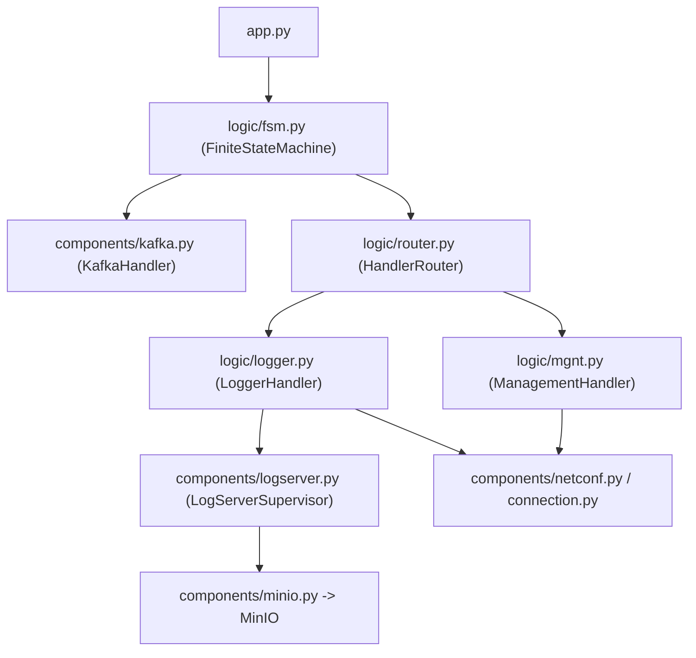
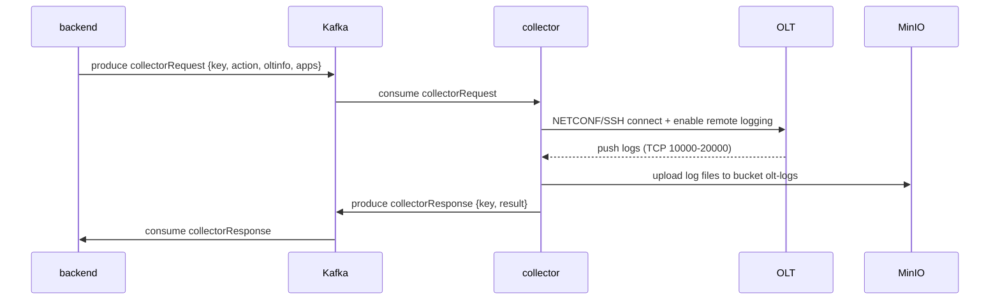

# collector

Python service that collects logs from OLTs on demand. It is driven by the
backend over Kafka: it connects to a target OLT via NETCONF/SSH, enables remote
logging (OLTs push logs back over TCP ports 10000-20000), uploads collected
logs to MinIO, and reports results back over Kafka.

## Structure



| Path | Responsibility |
|------|----------------|
| `src/app.py` | Entry point; starts the finite state machine |
| `src/logic/fsm.py` | Consumes Kafka `collectorRequest`, dispatches to handlers |
| `src/logic/router.py` | Routes a request to management or logger handlers |
| `src/logic/logger.py` | Starts log servers, enables OLT remote logging |
| `src/logic/mgnt.py` | Management/query operations |
| `src/components/kafka.py` | Kafka consumer/producer |
| `src/components/logserver.py` | Threaded TCP servers receiving pushed logs |
| `src/components/minio.py` | Uploads collected logs to MinIO |
| `src/components/netconf.py`, `connection.py`, `oltinfo.py` | OLT connectivity |
| `src/utils/env.py` | Platform + host IP detection |

## Request/response contract (Kafka)



## Configuration (environment-driven)

All connection details are read from environment variables so the same image
runs on the 238 server and on a local WSL host without code changes:

| Variable | Default | Description |
|----------|---------|-------------|
| `KAFKA_BOOTSTRAP` | `localhost:9094` | Kafka EXTERNAL listener (host networking) |
| `KAFKA_TOPIC_REQUEST` | `collectorRequest` | Request topic |
| `KAFKA_TOPIC_RESPONSE` | `collectorResponse` | Response topic |
| `KAFKA_GROUP_REQUEST` | `group-collector-request` | Consumer group |
| `MINIO_ENDPOINT` | `localhost:9000` | MinIO endpoint |
| `MINIO_ACCESS_KEY` / `MINIO_SECRET_KEY` | `eonu` / `eonu#1234` | Credentials |
| `MINIO_SECURE` | `false` | Use HTTPS for MinIO |
| `COLLECTOR_HOST_IP` | *(auto-detect)* | IP advertised to OLTs for log push |

When `COLLECTOR_HOST_IP` is empty the collector auto-detects the primary
outbound IPv4 address.

## Networking

The collector runs with `network_mode: host` and `privileged: true` because it
must be reachable by OLTs on dynamic log ports (10000-20000) and connects out to
OLTs on the management network. It reaches Kafka and MinIO through the host's
published ports (`localhost:9094` and `localhost:9000`).

## Build & run

```bash
cd ../deploy && docker compose up -d --build collector
```
