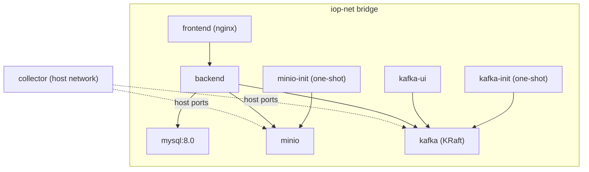
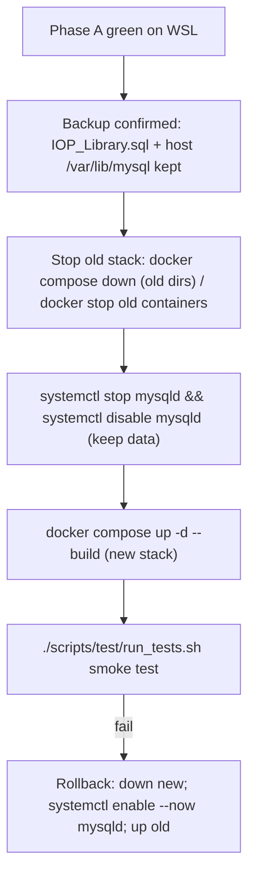

# deploy

Single-command deployment for the whole `iop-toolkit` stack via Docker Compose.

## Services



| Service | Image / Build | Ports (host) | Notes |
|---------|---------------|--------------|-------|
| `mysql` | `mysql:8.0` | `3306` | Named volume `mysql-data`; first-boot restore from `mysql/init/*.sql` |
| `minio` | `quay.io/minio/minio` | `9000`, `9001` | Named volume `minio-data` |
| `minio-init` | `quay.io/minio/mc` | - | One-shot: creates bucket `olt-logs` |
| `kafka` | `confluentinc/cp-kafka` | `9092`, `9094` | KRaft; dual listeners (see below) |
| `kafka-init` | `confluentinc/cp-kafka` | - | One-shot: creates request/response topics |
| `kafka-ui` | `provectuslabs/kafka-ui` | `9090` | Browser UI |
| `backend` | `../backend` | `8080` | Depends on mysql (healthy) + init jobs |
| `frontend` | `../frontend` | `80` | nginx serving SPA + `/api` proxy |
| `collector` | `../collector` | host net | `privileged`, host networking |

## Kafka dual listeners

Kafka advertises two listeners so both container-network and host-network
clients connect correctly without any `/etc/hosts` hacks:

- `INTERNAL://kafka:9092` - used by `backend` and `kafka-ui` on `iop-net`.
- `EXTERNAL://localhost:9094` - used by the host-networked `collector`.

## Configuration

Copy `.env.example` to `.env` and adjust as needed. Key variables: service
ports, MySQL/MinIO credentials, Kafka topic names, `VITE_API_BASE` (frontend
API base, empty for same-origin), `COLLECTOR_HOST_IP`, and optional build-time
`HTTP_PROXY`/`HTTPS_PROXY`.

## MySQL migration

`mysql:8.0` restores any `*.sql` in `mysql/init/` on first initialization
(empty data volume). Generate the dump from the running 238 server:

```bash
./scripts/migrate-mysql.sh                 # remote dump via SSH (default)
SRC_SSH="" ./scripts/migrate-mysql.sh      # local dump (when run on the server)
```

This writes `mysql/init/IOP_Library.sql` (self-contained: CREATE DATABASE +
USE + 7 tables). The dump is git-ignored.

## Auto-start on boot

All services use `restart: always`. This causes boot auto-start only where the
Docker daemon itself starts at boot:

- **238 server**: Docker starts at boot => the stack comes back automatically.
- **WSL**: the Docker daemon is not auto-started, so nothing runs until you
  start Docker and the stack manually. No per-platform config needed.

## Testing

```bash
./scripts/test/run_tests.sh
```

Checks: MySQL tables/data, MinIO bucket, Kafka topics, backend end-to-end
pipeline (upload -> parse -> OMCI JSON / PlantUML / diagram) with the bundled
sample log, and the frontend reverse proxy.

## Deployment sequence (target machine is the current 238)

Because the redeploy target is the same 238 server that is currently running,
validate on WSL first, then cut over on 238.

### Phase A - validate on WSL (Ubuntu)

```bash
cd deploy
cp .env.example .env
./scripts/migrate-mysql.sh          # read-only dump from 238
docker compose up -d --build
./scripts/test/run_tests.sh         # must pass before Phase B
```

### Phase B - cut over on 238 (Rocky)



Conflict avoidance:

- The new dockerized MySQL uses port 3306, so the host `mysqld` must be stopped
  first.
- The new stack uses a distinct compose project name (`iop-toolkit`) and
  container names (`iop-*`), so stopped old containers do not clash; a clean
  `docker compose down` of the old stack is recommended.
- Only one `collector` can bind the host log ports (10000-20000) at a time;
  ensure the old collector is stopped before starting the new one.
