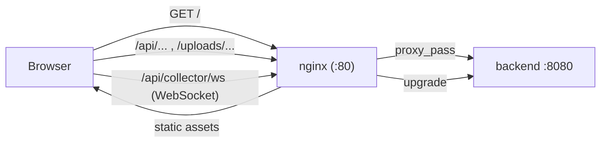

# frontend (webioptoolkit)

React + Vite single-page app for `iop-toolkit`. It is built to static assets and
served by nginx, which also reverse-proxies API traffic to the backend so the
frontend can be deployed independently on any host (server or WSL) without a CDN.

## Request path



## API base strategy

All pages import a single `API_BASE` from [`src/config/api.ts`](src/config/api.ts):

```ts
export const API_BASE = (import.meta.env.VITE_API_BASE ?? "") as string;
```

- **Default (empty)** => requests use **relative** paths (`/api/...`), resolved
  same-origin. This works both behind the nginx reverse proxy (production) and
  with the Vite dev-server proxy (development, see `vite.config.ts`).
- **Override** by setting `VITE_API_BASE` (build arg) to an absolute URL such as
  `http://10.101.15.238:8080` only when targeting a remote backend from a
  different origin.

WebSocket URLs are derived from `wsBaseUrl()`, which converts the http(s)
scheme to ws(s), falling back to the current page origin when `API_BASE` is
relative.

## Pages

| Route dir | Purpose |
|-----------|---------|
| `pages/omcianalyzer` | Upload logs, view ONUs, OMCI data, diagrams |
| `pages/collector` | Live collection UI, logger config, log list |
| `pages/library` | IOP library search / records |
| `pages/sequencetracer` | Sequence trace upload + render |
| `pages/downloads` | Browse/download server files |
| `pages/configanalyzer` | Config analyzer views |

## Independent deployment (no CDN required)

The frontend image is a multi-stage build: a `node:20` stage runs
`npm ci && npm run build`; the runtime stage is `nginx:1.27-alpine` serving
`dist/` with an SPA fallback and reverse-proxying `/api` and `/uploads` to
`backend:8080` (see [`nginx.conf`](nginx.conf)).

Because everything is same-origin through nginx, no CDN or cross-origin CORS
setup is needed. The same image runs on the internal server and on a local WSL
host.

## Build & run

```bash
# Local dev (proxies /api to localhost:8080 via vite.config.ts):
npm install && npm run dev

# Production (via compose):
cd ../deploy && docker compose up -d --build frontend
```
